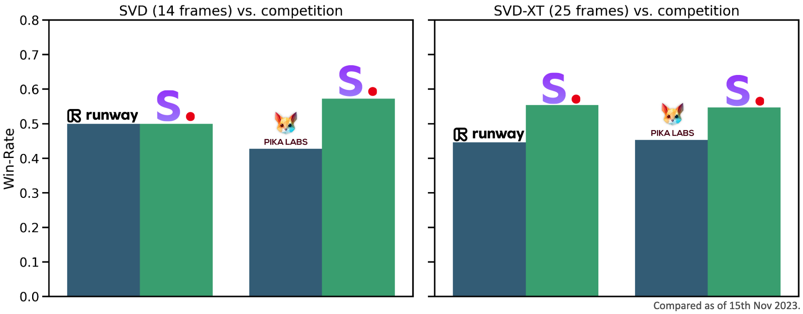

# Stable Video Diffusion Image-to-Video Model Card

<!-- Provide a quick summary of what the model is/does. -->

Stable Video Diffusion (SVD) Image-to-Video is a diffusion model that takes in a still image as a conditioning frame, and generates a video from it. 

Please note: For commercial use, please refer to https://stability.ai/license.

## Model Details

### Model Description

(SVD) Image-to-Video is a latent diffusion model trained to generate short video clips from an image conditioning. 
This model was trained to generate 25 frames at resolution 576x1024 given a context frame of the same size, finetuned from [SVD Image-to-Video [14 frames]](https://huggingface.co/stabilityai/stable-video-diffusion-img2vid).
We also finetune the widely used [f8-decoder](https://huggingface.co/docs/diffusers/api/models/autoencoderkl#loading-from-the-original-format) for temporal consistency. 
For convenience, we additionally provide the model with the 
standard frame-wise decoder [here](https://huggingface.co/stabilityai/stable-video-diffusion-img2vid-xt/blob/main/svd_xt_image_decoder.safetensors).

- **Developed by:** Stability AI
- **Funded by:** Stability AI
- **Model type:** Generative image-to-video model
- **Finetuned from model:** SVD Image-to-Video [14 frames]

### Model Sources

For research purposes, we recommend our `generative-models` Github repository (https://github.com/Stability-AI/generative-models), 
which implements the most popular diffusion frameworks (both training and inference).

- **Repository:** https://github.com/Stability-AI/generative-models
- **Paper:** https://stability.ai/research/stable-video-diffusion-scaling-latent-video-diffusion-models-to-large-datasets

## Evaluation

The chart above evaluates user preference for SVD-Image-to-Video over [GEN-2](https://research.runwayml.com/gen2) and [PikaLabs](https://www.pika.art/).
SVD-Image-to-Video is preferred by human voters in terms of video quality. For details on the user study, we refer to the [research paper](https://stability.ai/research/stable-video-diffusion-scaling-latent-video-diffusion-models-to-large-datasets)

## Uses

### Direct Use

The model is intended for both non-commercial and commercial usage. You can use this model for non-commercial or research purposes under this [license](https://huggingface.co/stabilityai/stable-video-diffusion-img2vid-xt/blob/main/LICENSE.md). Possible research areas and tasks include

- Research on generative models.
- Safe deployment of models which have the potential to generate harmful content.
- Probing and understanding the limitations and biases of generative models.
- Generation of artworks and use in design and other artistic processes.
- Applications in educational or creative tools.

For commercial use, please refer to https://stability.ai/license.

Excluded uses are described below.

### Out-of-Scope Use

The model was not trained to be factual or true representations of people or events, 
and therefore using the model to generate such content is out-of-scope for the abilities of this model.
The model should not be used in any way that violates Stability AI's [Acceptable Use Policy](https://stability.ai/use-policy).

## Limitations and Bias

### Limitations
- The generated videos are rather short (<= 4sec), and the model does not achieve perfect photorealism.
- The model may generate videos without motion, or very slow camera pans.
- The model cannot be controlled through text.
- The model cannot render legible text.
- Faces and people in general may not be generated properly.
- The autoencoding part of the model is lossy.

### Recommendations

The model is intended for both non-commercial and commercial usage.

## How to Get Started with the Model

Check out https://github.com/Stability-AI/generative-models

# Appendix: 

All considered potential data sources were included for final training, with none held out as the proposed data filtering methods described in the SVD paper handle the quality control/filtering of the dataset. With regards to safety/NSFW filtering, sources considered were either deemed safe or filtered with the in-house NSFW filters.
No explicit human labor is involved in training data preparation. However, human evaluation for model outputs and quality was extensively used to evaluate model quality and performance. The evaluations were performed with third-party contractor platforms (Amazon Sagemaker, Amazon Mechanical Turk, Prolific) with fluent English-speaking contractors from various countries, primarily from the USA, UK, and Canada. Each worker was paid $12/hr for the time invested in the evaluation.
No other third party was involved in the development of this model; the model was fully developed in-house at Stability AI.
Training the SVD checkpoints required a total of approximately 200,000 A100 80GB hours. The majority of the training occurred on 48 * 8 A100s, while some stages took more/less than that. The resulting CO2 emission is ~19,000kg CO2 eq., and energy consumed is ~64000 kWh.
The released checkpoints (SVD/SVD-XT) are image-to-video models that generate short videos/animations closely following the given input image. Since the model relies on an existing supplied image, the potential risks of disclosing specific material or novel unsafe content are minimal. This was also evaluated by third-party independent red-teaming services, which agree with our conclusion to a high degree of confidence (>90% in various areas of safety red-teaming). The external evaluations were also performed for trustworthiness, leading to >95% confidence in real, trustworthy videos.
With the default settings at the time of release, SVD takes ~100s for generation, and SVD-XT takes ~180s on an A100 80GB card. Several optimizations to trade off quality / memory / speed can be done to perform faster inference or inference on lower VRAM cards.
The information related to the model and its development process and usage protocols can be found in the GitHub repo, associated research paper, and HuggingFace model page/cards. 
The released model inference & demo code has image-level watermarking enabled by default, which can be used to detect the outputs. This is done via the imWatermark Python library.  
The model can be used to generate videos from static initial images. However, we prohibit unlawful, obscene, or misleading uses of the model consistent with the terms of our license and Acceptable Use Policy. For the open-weights release, our training data filtering mitigations alleviate this risk to some extent. These restrictions are explicitly enforced on user-facing interfaces at stablevideo.com, where a warning is issued. We do not take any responsibility for third-party interfaces. Submitting initial images that bypass input filters to tease out offensive or inappropriate content listed above is also prohibited. Safety filtering checks at stablevideo.com run on model inputs and outputs independently. More details on our user-facing interfaces can be found here: https://www.stablevideo.com/faq. Beyond the Acceptable Use Policy and other mitigations and conditions described here, the model is not subject to additional model behavior interventions of the type described in the Foundation Model Transparency Index.
For stablevideo.com, we store preference data in the form of upvotes/downvotes on user-generated videos, and we have a pairwise ranker that runs while a user generates videos. This usage data is solely used for improving Stability AI’s future image/video models and services. No other third-party entities are given access to the usage data beyond Stability AI and maintainers of stablevideo.com. 
For usage statistics of SVD, we refer interested users to HuggingFace model download/usage statistics as a primary indicator. Third-party applications also have reported model usage statistics. We might also consider releasing aggregate usage statistics of stablevideo.com on reaching some milestones.
